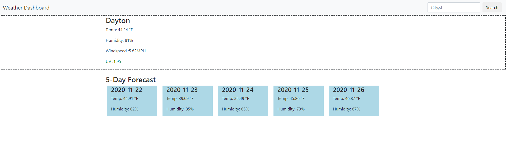

# HW6-ServerSide-APIs-WeatherDashboard

This repository is for a basic weather dashboard using the openweathermap api.
I used 3 ajax calls to get the current weather, the forecast, and the UV Index

Empty divs were created in HTML then updated and populated dynamically with JS. 
The current day displays Temp, humidity, windspeed and UV Index. The UV index adjusts color acording to the severity that day.

## Example screenshot and link to the deployed site.
https://thecoaxial.github.io/HW6-ServerSide-APIs-WeatherDashboard/index.html?

